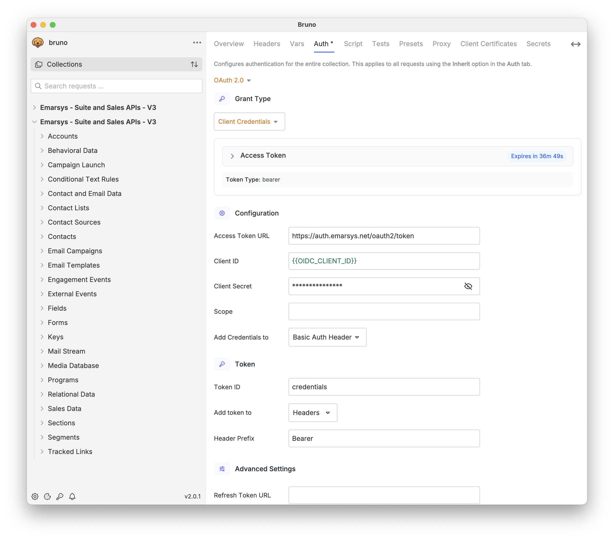
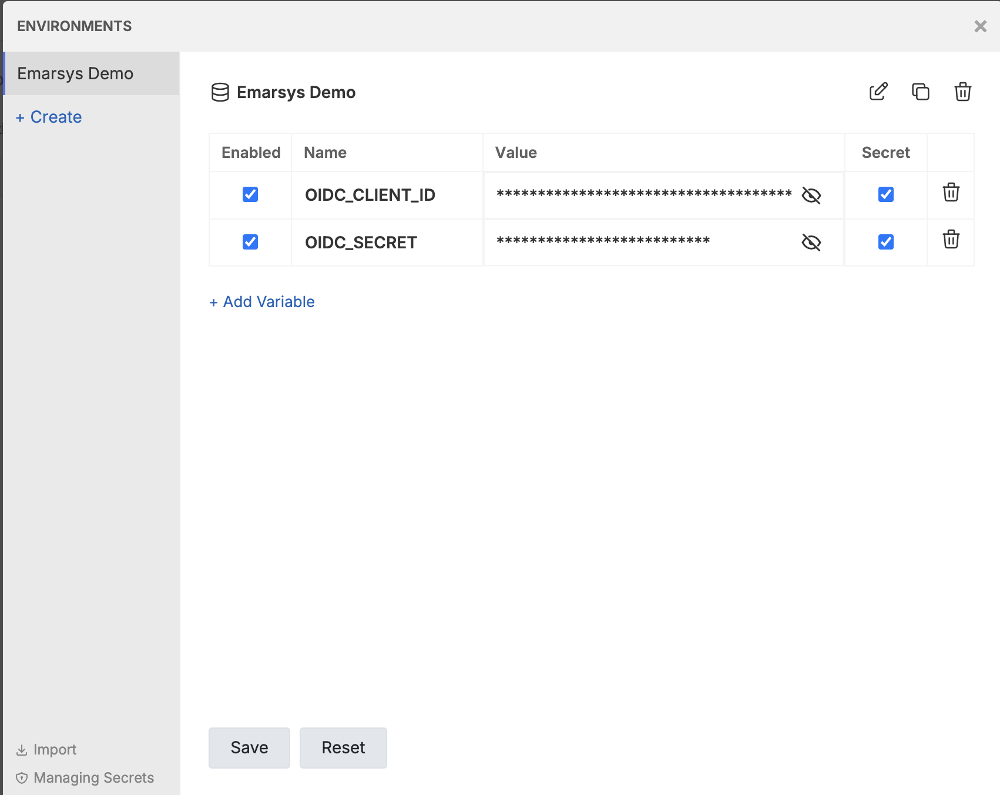

# Emarsys API Developer tooling
**Written in the Postman format and tested with Bruno**

This document describes the Emarsys Suite API v3, which uses OpenID Connect (OAuth 2.0 client credentials grant) authentication. 

- Other API collections, including the Emarsys suite WSSE APIs: [link](./wsse_APIs/)
- Introduction to Emarsys API: [link](https://help.emarsys.com/hc/en-us/articles/115004745889-API-Introduction-to-the-Emarsys-API)
- Creating your API credentials: [link](https://help.emarsys.com/hc/en-us/articles/22036625729554-Security-settings-API-Credentials)

### For an open source alternative to Postman, this collection is also compatible with Bruno, as described [here](#Using-this-collection-with-Bruno).

## Creating your API user

To create your API user, follow [this documentation guide for OpenID Connect](https://help.sap.com/docs/SAP_EMARSYS/5d44574160f44536b0130abf58cb87cc/fdf4b58974c110149353957a3e7ef453.html#openid-connect)

> [!NOTE]
> Be sure to copy your all of the credential details from the gray text boxes to a secure location immediately, as you won't be able to access them again!

## Using with Postman

### Installing the collection in Postman
1. First, make sure you have Postman installed. These collections are meant to be used with the program Postman, which can be downloaded here: https://www.postman.com/downloads/
1. Download this repository by clicking on the Green "Code" button at the top of this page, then "Download Zip":
  
3. Extract the files from the .zip folder
4. With Postman installed and the collections downloaded, click on the import button in the top-left:
  
1. Select The upload files option:
    
1. Select the file "Emarsys Postman Collection" from the downloaded files
    
1. Finally, select the import button to confirm and the package will be fully installed!
 
### Setting up your API user in Postman

1. In Postman, click on the folder for the Emarsys API collection, then select the Authorization tab
1. Scroll down to the "Configure New Token" section where you will see red text in the boxes for Client ID and Client Secret

1. Hover your mouse over the red text for {{OIDC_ClientID}} to see the options of where to store this variable. Click the Environment section to save the variable. If you see text that says "No environment selected", click "Create One" and give it a name like "Emarsys environment"

    
1. In the "Enter Value" checkbox, enter the value you saved from the Emarsys API user creation screen. Do this for Client ID and Client Secret. The text for each will turn from red to blue once it's configured correctly
    1. ***NOTE*** If you are using [SAP Cloud Identities](https://help.emarsys.com/hc/en-us/articles/22036625729554-Security-settings-API-Credentials#openid-connect-sap-cloud-identity) to manage your Emarsys API credentials, you will need to replace the Access Token URL as well
1. Scroll to the bottom of the window and click the Orange "Get New Access Token" button. Postman will take a moment to make sure your credentials work, then report it was successful. Click "Proceed" on this window, then click "Use Token"
1. Your credentials are now configured!

# Using this collection with Bruno

[Bruno](https://docs.usebruno.com/) is an open-source API tool that is very similar to Postman, but is fully free to use and is supported by the Open-Source community.

### Installing the collection in Bruno

1. Make sure you have Bruno installed. You can download Bruno here: https://www.usebruno.com/downloads
1. Download this repository by clicking on the Green "Code" button at the top of this page, then "Download Zip":

    

1. Extract the files from the .zip folder
1. With Bruno downloaded and the collections downloaded, click on the Import Collection button:

    

1. Select "Postman Collection" for the collection type
1. Select the file "Emarsys_postman_collection.json" from the files you downloaded previously and press open:

    

1. Bruno will then ask you where you'd like to save the imported collection. Select any location on your computer you would like to store your work in Bruno. A good option may be your Documents folder, or a project folder where you keep your work on Emarsys. After you do so, the API collection will be visible in Bruno.

1. Begin setting up your authentication to the API by clicking on the name of the collection in the left-hand menu and then selecting the tab "Auth". In that page, apply the following settings:

    - Set the "Grant Type" dropdown to "Client Credentials"
    - Set the Access Token URL to "https://auth.emarsys.net/oauth2/token"
    - Set the Client ID to {{OIDC_CLIENT_ID}}
    - Set the Client Secret to {{OIDC_SECRET}}
    - Set the "Add Credentials to" dropdown to "Basic Auth Header"
    - Lower down, in the Settings section, check the box for "Automatically fetch token if not found"
    - Click "Get Access Token" to test the settings
    - Click Save

    

1. Bruno is now configured and ready for you to fill in your API credentials. Follow the steps for configuring your environments in the next section before sending your first request

### Setting up your API user in Bruno

This collection uses Bruno Environment Variables to manage the credentials for the account(s) you work with.

[This guide goes over how to create those environments](https://docs.usebruno.com/secrets-management/secret-variables)

The required variables are:
- OIDC_CLIENT_ID
- OIDC_SECRET

> [!NOTE]
> If you are using [SAP Cloud Identities](https://help.emarsys.com/hc/en-us/articles/22036625729554-Security-settings-API-Credentials#openid-connect-sap-cloud-identity) to manage your Emarsys API credentials, you will need to add your Access Token URL in the variable "OIDC_SCI_HOST"
